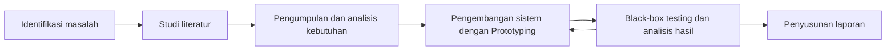

# BAB I

# PENDAHULUAN

## 1.1 Latar Belakang

Tugas akhir merupakan proses akademik yang mempertemukan kegiatan penelitian atau pelaksanaan jalur akademik mahasiswa dengan serangkaian layanan administratif. Dalam pelaksanaannya, mahasiswa tidak hanya menghasilkan laporan, tetapi juga melewati pendaftaran, pemeriksaan kelayakan, penetapan pembimbing, bimbingan, pemantauan progres, pendaftaran sidang, penjadwalan, penilaian, revisi, dan penyelesaian persyaratan kelulusan. Setiap tahap menghasilkan data dan keputusan yang menjadi masukan bagi tahap berikutnya. Oleh sebab itu, pengelolaan tugas akhir membutuhkan lebih dari sekadar tempat penyimpanan dokumen; pengelolaan tersebut memerlukan alur kerja yang mampu menghubungkan aktor, data, status, keputusan, dan histori proses secara konsisten.

Kebutuhan integrasi tersebut sejalan dengan perkembangan transformasi digital di perguruan tinggi. Transformasi digital tidak cukup dimaknai sebagai perubahan dokumen kertas menjadi formulir elektronik, tetapi juga mencakup penataan ulang proses, peran, dan cara institusi memanfaatkan informasi. Tinjauan sistematis Bisri dkk. (2023) menunjukkan bahwa keberhasilan transformasi digital perguruan tinggi dipengaruhi oleh kepemimpinan, strategi implementasi, serta kemampuan institusi mengatasi hambatan organisasi. Sementara itu, Skoumpopoulou dan Abdelrahman (2022) menemukan bahwa penerapan sistem informasi terintegrasi di perguruan tinggi tidak hanya berkaitan dengan pemasangan teknologi, tetapi juga berdampak pada proses organisasi dan para pemangku kepentingan. Kedua penelitian tersebut menunjukkan bahwa integrasi sistem perlu diarahkan pada penyelesaian masalah proses dan kebutuhan pengguna, bukan hanya pada penyatuan aplikasi secara teknis.

Program Studi Informatika Universitas Islam Indonesia telah menggunakan Sistem Informasi Manajemen Tugas Akhir (SEKAWAN) untuk mendukung kegiatan akademik dan administratif mahasiswa tingkat akhir (Kusumo dan Suranto, 2023). Kusumo dan Suranto (2023) mengevaluasi pengalaman pengguna SEKAWAN menggunakan *User Experience Questionnaire* (UEQ) terhadap 100 responden. Hasilnya menunjukkan nilai positif pada enam aspek UEQ, dengan nilai rata-rata tertinggi pada efisiensi sebesar 1,80 dan nilai terendah pada kebaruan sebesar 0,90 (Kusumo dan Suranto, 2023). Meskipun hasil keseluruhannya positif, penelitian tersebut juga mengidentifikasi kebutuhan perbaikan karena informasi yang disediakan belum sepenuhnya memenuhi kebutuhan mahasiswa (Kusumo dan Suranto, 2023). Temuan itu memperlihatkan dua hal. Pertama, keberadaan sistem digital telah mendukung proses tugas akhir pada konteks yang diteliti. Kedua, sistem yang telah berjalan tetap membutuhkan evaluasi dan pengembangan agar informasi, alur, dan tindakan yang tersedia sesuai dengan kebutuhan pengguna yang terus berkembang.

Berdasarkan komunikasi awal dengan Sekretaris Program Studi Informatika UII pada 25 September 2025, pengelolaan proses skripsi masih melibatkan beberapa media (Sekretaris Program Studi Informatika UII, komunikasi pribadi, 25 September 2025). Data penjaluran direkap menggunakan spreadsheet, sebagian pendaftaran menggunakan formulir daring, dan aktivitas mahasiswa tingkat akhir juga berhubungan dengan SEKAWAN (Sekretaris Program Studi Informatika UII, komunikasi pribadi, 25 September 2025). Pada tahap pendadaran, pengelola perlu memeriksa kembali data akademik, dokumen, persetujuan pembimbing, kesediaan dosen, serta ketersediaan ruang sebelum mahasiswa dapat dijadwalkan (Sekretaris Program Studi Informatika UII, komunikasi pribadi, 25 September 2025). Informasi yang diperlukan tidak selalu berada pada sumber yang sama sehingga pengelola harus mencocokkan dan memindahkan data antarmedia (Sekretaris Program Studi Informatika UII, komunikasi pribadi, 25 September 2025).

Penggunaan perangkat digital yang terpisah memang lebih baik daripada pencatatan kertas sepenuhnya, tetapi belum otomatis menghasilkan proses yang terintegrasi. Ketika formulir, spreadsheet, aplikasi, dan komunikasi personal berdiri sendiri, setiap media dapat menyimpan representasi status yang berbeda. Sebagai contoh, mahasiswa dapat tercatat telah mengisi formulir, tetapi persetujuan pembimbingnya belum tersedia; dokumen dapat telah diunggah, tetapi belum diverifikasi; atau dosen dapat telah menyatakan kesediaan, tetapi data tersebut belum digunakan pada rekap penjadwalan. Dalam keadaan demikian, pengelola masih menjadi penghubung manual yang menentukan data mana yang paling mutakhir. Permasalahan utamanya bukan semata-mata penggunaan spreadsheet atau formulir daring, melainkan tidak tersedianya satu alur yang menjaga hubungan antardata dan menjelaskan siapa yang membuat keputusan, kapan keputusan dibuat, serta akibat keputusan tersebut terhadap tahap berikutnya.

Masalah serupa juga ditemukan pada pengelolaan skripsi di institusi lain. Thamrin dan Andriani (2021) menjelaskan bahwa penggunaan Microsoft Excel dalam pengelolaan data skripsi menyebabkan proses pengolahan membutuhkan waktu lebih panjang, sedangkan pengajuan judul dan penyampaian informasi masih mengharuskan mahasiswa berinteraksi secara terpisah dengan bagian akademik. Penelitian tersebut menghasilkan rancangan sistem berbasis web untuk mengelola pengguna, pengajuan judul, dokumen, dan laporan (Thamrin dan Andriani, 2021). Arizal dkk. (2022) juga menunjukkan bahwa proses administrasi dan pemantauan tugas akhir yang belum sistematis dapat menghambat penyelesaian tugas akhir. Sistem berbasis web yang mereka kembangkan dengan metodologi Prototyping digunakan untuk mendukung layanan administrasi dan monitoring secara lebih terstruktur (Arizal dkk., 2022). Temuan penelitian terdahulu tersebut tidak digunakan untuk menyimpulkan kondisi Informatika UII, tetapi memperlihatkan bahwa fragmentasi administrasi dan kebutuhan pemantauan merupakan masalah yang juga muncul dalam konteks pengelolaan tugas akhir di institusi lain.

Kompleksitas di Informatika UII bertambah karena proses skripsi tidak terdiri atas satu jalur yang seragam. Berdasarkan hasil analisis kebutuhan, pengembangan sistem pada penelitian ini mencakup empat jalur, yaitu Penelitian, Magang, Perintisan Bisnis, dan Pengabdian Masyarakat. Keempat jalur tersebut memiliki tujuan, bentuk pengajuan, data, dan reviewer yang berbeda. Jalur Penelitian berkaitan dengan topik dosen atau judul mandiri dan review bidang atau klaster. Jalur Magang berkaitan dengan mitra, aktivitas magang, dan penanggung jawab jalur. Jalur Perintisan Bisnis melibatkan kelompok serta kelengkapan yang berkaitan dengan usaha yang dirintis. Jalur Pengabdian Masyarakat tetap menjadi bagian dari kebutuhan, implementasi, dan pengujian SIMPS, meskipun pengerjaannya ditempatkan setelah stabilisasi tiga jalur lainnya. Perbedaan karakteristik tersebut menyebabkan satu formulir dan satu alur persetujuan tidak dapat diterapkan secara identik pada seluruh jalur.

Hasil pemetaan proses menunjukkan bahwa sistem perlu membedakan jenis pendaftaran. Pendaftaran `baru` digunakan ketika mahasiswa memulai siklus penjaluran pertama. Pendaftaran `ulang` digunakan ketika mahasiswa memulai siklus baru pada jalur yang sama. Pendaftaran `alih` digunakan ketika mahasiswa berpindah ke jalur yang berbeda. Pendaftaran ulang dan alih tidak sama dengan kelanjutan pengerjaan pada semester berikutnya. Mahasiswa yang masih mengerjakan skripsi dengan jalur dan pembimbing yang sama melanjutkan siklusnya melalui proses pergantian semester atau izin lanjut, sedangkan pendaftaran ulang dan alih membentuk siklus baru. Pembedaan ini penting karena setiap proses mempunyai dampak berbeda terhadap jalur aktif, pembimbing, mata kuliah penjaluran, kelompok, dan histori mahasiswa.

Pada proses pendaftaran ulang atau alih jalur, mahasiswa dapat masih memiliki penetapan pembimbing aktif. Catatan bimbingan pertama menekankan perlunya pemberitahuan dan persetujuan pamit kepada pembimbing lama sebelum mahasiswa melanjutkan proses baru (Sekretaris Program Studi Informatika UII, komunikasi pribadi, 25 September 2025). Berdasarkan hasil analisis kebutuhan, persetujuan pamit mengakhiri penetapan pembimbing lama tanpa menghapus bimbingan, keputusan, dan aktivitas yang telah terjadi. Setelah itu, pengajuan pada siklus baru diproses sesuai jalur tujuan dan pembimbing baru ditetapkan melalui keputusan akhir Sekretaris Program Studi. Mekanisme tersebut menunjukkan bahwa data lama tidak boleh ditimpa hanya karena status mahasiswa berubah. Sistem perlu membedakan data aktif dari data historis dan mempertahankan hubungan antara siklus lama dengan siklus berikutnya.

Kebutuhan histori tidak berhenti pada perubahan jalur. Catatan bimbingan juga meminta agar aktivitas mahasiswa dapat dilihat per semester: pada semester tertentu mahasiswa berada pada jalur apa, melakukan aktivitas apa, dan dibimbing oleh siapa (Sekretaris Program Studi Informatika UII, komunikasi pribadi, 25 September 2025). Hasil analisis kebutuhan menunjukkan bahwa informasi tersebut diperlukan karena pengerjaan skripsi dapat berlangsung lebih dari satu semester, pembimbing dapat berubah, dan izin lanjut dapat disetujui atau ditolak. Jika sistem hanya menyimpan pembimbing terakhir pada data mahasiswa, informasi mengenai pembimbing sebelumnya, waktu berlakunya penetapan, serta alasan pergantian akan hilang. Karena itu, penetapan pembimbing dimodelkan sebagai histori yang mempunyai periode mulai, periode selesai, peran P1/P2, status, dan alasan perubahan. Setiap bimbingan kemudian ditautkan kepada penetapan dan semester yang benar agar aktivitas tidak salah dibebankan kepada pembimbing atau siklus lain.

Hasil analisis aktor dan kewenangan menunjukkan adanya pemisahan tanggung jawab dalam alur keputusan. Admin mengelola master mahasiswa, master dosen, status akun, dan impor data teknis. Sekretaris Program Studi mengelola periode, keputusan akademik akhir, penetapan pembimbing, verifikasi pendadaran, dan penjadwalan. Dosen dapat bertindak sebagai pemilik topik, ketua klaster, pengampu jalur, pembimbing, atau penguji berdasarkan penugasan yang melekat pada akun yang sama. Mahasiswa bertindak sebagai pemohon dan pelaksana proses akademik. Pemisahan tersebut diperlukan agar perubahan data teknis tidak otomatis menjadi keputusan akademik dan agar setiap keputusan dapat ditelusuri kepada aktor yang berwenang. Dengan demikian, autentikasi saja belum cukup; sistem juga memerlukan otorisasi berdasarkan peran, penugasan, objek, dan tahap proses.

Berdasarkan pemetaan alur penjaluran, Sekretaris Program Studi menetapkan Pembimbing 1 dan, sesuai kebutuhan jalur, Pembimbing 2 setelah pengajuan disetujui. Persetujuan reviewer jalur tidak langsung mengaktifkan pembimbing karena reviewer tidak selalu menjadi dosen yang ditugaskan membimbing. Pembedaan antara reviewer dan pembimbing penting untuk mencegah sistem menyimpulkan hubungan akademik hanya dari satu tindakan persetujuan. Setelah penetapan aktif, mahasiswa mengajukan bimbingan kepada pembimbing yang berwenang, sedangkan dosen meninjau permohonan dan resume bimbingan. Setiap perubahan resume dan keputusan disimpan sebagai versi agar koreksi tidak menghilangkan catatan sebelumnya. Pendekatan tersebut mendukung keterlacakan dan memungkinkan Program Studi menilai progres berdasarkan bukti yang terhubung dengan semester dan siklus yang tepat.

Hasil analisis kebutuhan akademik menunjukkan bahwa jalur yang dipilih berkaitan dengan mata kuliah penjaluran dan kelayakan menuju pendadaran. Nilai mata kuliah penjaluran diperlakukan sebagai data akademik yang dibaca sistem, bukan nilai yang ditentukan oleh pengelola SIMPS. Jika mahasiswa tidak lulus mata kuliah penjaluran, kebutuhan mengulang mata kuliah dicatat tanpa otomatis membuat siklus penjaluran atau pembimbing baru. Jika mahasiswa beralih jalur, kewajiban akademiknya mengikuti jalur tujuan dengan tetap mempertahankan histori nilai pada jalur lama. Pemisahan antara status akademik dan status alur kerja mencegah tindakan administratif menghasilkan nilai atau keputusan akademik yang tidak berasal dari sumber resmi.

Tahap pendadaran mempertemukan data dari hampir seluruh proses sebelumnya. Berdasarkan catatan bimbingan, mahasiswa hanya dapat masuk ke penjadwalan apabila seluruh persyaratan wajib telah valid (Sekretaris Program Studi Informatika UII, komunikasi pribadi, 25 September 2025). Hasil analisis kebutuhan merinci persyaratan tersebut menjadi progres bimbingan, persetujuan pembimbing, transkrip, total SKS, kelulusan mata kuliah wajib, kelulusan mata kuliah penjaluran sesuai jalur aktif, sertifikat dan skor CEPT, laporan tugas akhir, bukti logbook, serta dokumen publikasi atau LOA sesuai ketentuan jalur. Setiap item persyaratan menyimpan status, pemeriksa, waktu pemeriksaan, dan catatan. Mahasiswa yang masih memiliki persyaratan tidak valid ditahan dari antrean penjadwalan dan sistem menampilkan rincian persyaratan yang harus dipenuhi. Pembatalan verifikasi dikonfirmasi dan dicatat agar status tidak berubah akibat tindakan yang tidak disengaja.

Kelayakan yang jelas menjadi penting karena penjadwalan hanya boleh menggunakan mahasiswa yang benar-benar siap. Apabila mahasiswa yang belum lengkap ikut diproses, jadwal dapat terbentuk tetapi kemudian harus diubah ketika kekurangannya ditemukan. Perubahan tersebut memengaruhi mahasiswa, pembimbing, penguji, ruangan, dan slot lain. Oleh sebab itu, verifikasi tidak diposisikan sebagai tanda centang yang berdiri sendiri, tetapi sebagai gerbang yang dibentuk dari bukti dan aturan yang dapat diperiksa kembali. Nilai batas, seperti skor minimum CEPT atau jumlah bimbingan, juga sebaiknya disimpan sebagai kebijakan yang dapat disesuaikan agar perubahan aturan akademik tidak selalu mengharuskan perubahan kode aplikasi.

Penjadwalan pendadaran merupakan bagian lain yang memiliki kompleksitas tinggi. Hasil pemetaan proses menunjukkan bahwa Sekretaris Program Studi menentukan rentang tanggal, tanggal pengecualian, sesi, durasi, waktu istirahat, dan ruang yang dapat digunakan. Dosen kemudian mengisi ketersediaan pada slot tersebut. Setiap sidang melibatkan tepat tiga dosen, yaitu satu pembimbing dan dua penguji. Sistem menolak jadwal apabila seorang dosen, mahasiswa, atau ruangan digunakan pada dua sidang dalam waktu yang sama. Selain aturan tanpa bentrok, pemilihan penguji juga mempertimbangkan bidang mahasiswa, profil penguji, pemerataan penugasan, dan kenyamanan perpindahan ruang.

Almeida dkk. (2024) menjelaskan bahwa penjadwalan sidang tesis mencakup penetapan anggota komite, peran, mahasiswa, waktu, dan ruangan. Jadwal yang layak harus memenuhi komposisi komite serta ketersediaan anggota dan ruangan, sedangkan kualitas jadwal dapat dipengaruhi oleh kesesuaian keahlian, pemerataan beban, kepadatan jadwal, preferensi waktu, dan perpindahan ruang (Almeida dkk., 2024). Penelitian tersebut menunjukkan bahwa penjadwalan sidang merupakan masalah multiobjektif dan bukan sekadar pengisian kalender (Almeida dkk., 2024). Model yang mereka kembangkan juga secara signifikan mengungguli jadwal yang disusun manusia pada studi kasus yang diuji (Almeida dkk., 2024). Walaupun penelitian SIMPS tidak harus menggunakan model optimasi yang sama, hasil tersebut memperkuat alasan bahwa aturan ketersediaan, komposisi penguji, dan konflik sumber daya perlu direpresentasikan secara eksplisit dalam sistem.

Catatan bimbingan pertama memberikan ilustrasi beban penjadwalan sekitar 70 mahasiswa dalam satu periode (Sekretaris Program Studi Informatika UII, komunikasi pribadi, 25 September 2025). Karena setiap sidang membutuhkan satu pembimbing dan dua penguji, ilustrasi tersebut menghasilkan 210 penugasan dosen (Sekretaris Program Studi Informatika UII, komunikasi pribadi, 25 September 2025). Berdasarkan hasil pemetaan proses, setiap penugasan dipadankan dengan ketersediaan dosen, kesesuaian bidang, profil penguji, sesi, dan ruangan. Besarnya jumlah penugasan dan banyaknya kendala yang diperiksa menunjukkan bahwa penjadwalan pendadaran membutuhkan validasi konflik secara sistematis, bukan hanya penyusunan urutan mahasiswa pada kalender.

Sejumlah penelitian terdahulu telah membahas bagian-bagian dari masalah pengelolaan tugas akhir. Perbandingannya diringkas pada Tabel 1.1.

**Tabel 1.1 Perbandingan penelitian terdahulu dan posisi penelitian**

| Penelitian | Fokus dan hasil yang relevan | Batas terhadap kebutuhan SIMPS |
|---|---|---|
| Thamrin dan Andriani (2021) | Perancangan sistem pendaftaran dan pengelolaan data skripsi berbasis web untuk mengatasi pengolahan berbasis Excel, pengajuan judul, dokumen, dan laporan. | Berfokus pada pendaftaran dan pengelolaan data; belum membahas empat jalur, siklus baru/ulang/alih, histori pembimbing per semester, serta penjadwalan multi-kendala. |
| Arizal dkk. (2022) | Penerapan Prototyping pada sistem manajemen tugas akhir berbasis web untuk membantu administrasi, bimbingan, dan monitoring. | Menunjukkan relevansi Prototyping pada domain tugas akhir, tetapi aturan institusi dan siklus proses tidak sama dengan SIMPS. |
| Kusumo dan Suranto (2023) | Evaluasi UX SEKAWAN di Informatika UII menggunakan UEQ dan menghasilkan penilaian positif pada enam aspek serta usulan perbaikan informasi/tampilan. | Berfokus pada evaluasi pengalaman pengguna sistem yang sudah ada, bukan integrasi keseluruhan flow penjaluran, histori, verifikasi, dan penjadwalan. |
| Fitria dkk. (2024) | Pengembangan sistem berbasis web dengan Prototyping untuk data mahasiswa, dosen, judul proposal, persetujuan, bimbingan, dan laporan. | Cakupan utamanya pengelolaan judul proposal; belum menangani lifecycle lintas jalur dan penjadwalan pendadaran. |
| Almeida dkk. (2024) | Model optimasi multiobjektif untuk penetapan komite, waktu, dan ruang sidang tesis dengan berbagai kendala. | Mendalami optimasi penjadwalan, tetapi tidak mencakup proses sebelum sidang seperti penjaluran, pembimbing, bimbingan, dan verifikasi kelayakan. |
| Penelitian SIMPS | Integrasi empat jalur skripsi, pendaftaran baru/ulang/alih, histori pembimbing dan bimbingan per semester, data akademik, verifikasi persyaratan, serta penjadwalan pendadaran berbasis peran dan histori. | Fokus berada pada kesesuaian flow lokal Informatika UII; generalisasi ke institusi lain bukan tujuan utama. |

Perbandingan tersebut menunjukkan kesenjangan pada integrasi proses. Penelitian sebelumnya umumnya mendalami satu atau beberapa bagian, seperti pengajuan judul, administrasi bimbingan, evaluasi pengalaman pengguna, atau optimasi jadwal. Sementara itu, permasalahan Informatika UII membutuhkan hubungan antartahap: keputusan penjaluran menentukan jalur dan pembimbing; pembimbing serta histori semester menentukan kewenangan bimbingan; progres dan data akademik menentukan kelayakan; kelayakan menentukan siapa yang boleh dijadwalkan; dan jadwal bergantung pada komposisi dosen, ketersediaan, serta ruang. Jika bagian-bagian tersebut dikembangkan sebagai modul yang tidak berbagi sumber kebenaran, masalah rekonsiliasi data berpotensi muncul kembali di dalam aplikasi baru.

Berdasarkan kesenjangan tersebut, penelitian ini mengembangkan Sistem Informasi Manajemen Proses Skripsi (SIMPS) berbasis web. Kontribusi utama penelitian bukan sekadar memindahkan formulir ke aplikasi, tetapi memodelkan flow proses skripsi sebagai rangkaian status dan keputusan yang dapat ditelusuri. Sistem menggunakan data terpusat, otorisasi berbasis peran dan penugasan, histori yang tidak ditimpa, serta validasi transisi agar suatu tahap hanya dapat berlangsung ketika prasyaratnya terpenuhi. Flow sistem pada repository digunakan sebagai konteks utama karena merepresentasikan hubungan antarmodul yang sedang dikembangkan. Catatan bimbingan digunakan untuk menjelaskan alasan operasional dan pengetahuan pengguna yang belum selalu terlihat pada struktur data atau antarmuka.

Metodologi Prototyping dipilih karena kebutuhan SIMPS bersifat rinci, lintas peran, dan berkembang melalui klarifikasi dengan pemilik proses. Yue dan Feng (2021) menjelaskan bahwa prototipe dapat digunakan untuk mengurangi ketidaklengkapan, ambiguitas, dan inkonsistensi pada deskripsi kebutuhan. Kang dkk. (2023) juga menunjukkan bahwa prototipe dapat membantu elisitasi kebutuhan pada tahap awal karena pengguna memperoleh representasi yang lebih konkret untuk dievaluasi. Dalam domain tugas akhir, Arizal dkk. (2022) menerapkan Prototyping agar pengembang dan pengguna dapat berkomunikasi melalui bentuk sistem yang dapat diperiksa. Dengan demikian, purwarupa dalam penelitian ini tidak hanya digunakan untuk memilih warna atau tata letak, tetapi untuk memvalidasi aktor, urutan aktivitas, status, aturan penolakan, data yang ditampilkan, dan akibat setiap keputusan.

Prototyping juga sesuai untuk memvalidasi aturan yang melibatkan banyak aktor dan variasi jalur. Melalui iterasi purwarupa, urutan review, kebutuhan pembimbing, profil penguji, ketentuan dokumen, dan konsekuensi setiap keputusan dapat diperiksa langsung oleh pemilik proses. Hasil evaluasi setiap iterasi diterjemahkan secara konsisten ke dalam aturan bisnis, model proses, rancangan data, antarmuka, dan skenario pengujian. Dengan cara tersebut, perubahan kebutuhan tidak hanya menghasilkan perubahan tampilan, tetapi juga memperbarui perilaku sistem dan bukti penerimaannya.

Keberhasilan penelitian tidak dapat dinilai hanya dari tersedianya halaman dan tombol. ISO dan IEC (2023) menjelaskan bahwa model kualitas produk perangkat lunak dapat digunakan untuk merumuskan kebutuhan, tujuan pengujian, kriteria pengendalian kualitas, dan kriteria penerimaan. Berdasarkan karakter masalah SIMPS, pengujian perlu memeriksa kesesuaian fungsi, otorisasi, validitas transisi status, konsistensi histori, verifikasi persyaratan, dan pencegahan bentrok jadwal.

Penelitian ini menggunakan *black-box testing* untuk menguji fungsi sistem berdasarkan masukan, kondisi proses, dan keluaran yang diharapkan tanpa memeriksa struktur internal kode. Teknik ini sesuai untuk memeriksa apakah setiap fungsi dan aturan bisnis memberikan respons yang benar pada skenario valid maupun tidak valid. Kasus uji disusun menggunakan partisi ekuivalensi, analisis nilai batas, tabel keputusan, dan transisi status yang relevan dengan karakteristik workflow SIMPS (ISTQB, 2024). Hasil aktual dibandingkan dengan hasil yang diharapkan dan dicatat sebagai berhasil atau gagal beserta bukti pengujiannya.

Dengan arah tersebut, penelitian diharapkan menghasilkan dua jenis keluaran. Keluaran praktis berupa aplikasi web yang mendukung proses yang menjadi scope. Keluaran akademik berupa analisis kebutuhan, model proses, aturan bisnis, rancangan data, catatan iterasi Prototyping, serta hasil evaluasi yang menjelaskan tingkat kesesuaian sistem terhadap masalah awal. Hasil penelitian kemudian digunakan untuk menjawab apakah penerapan Prototyping mampu menghasilkan SIMPS yang sesuai dengan flow pengelolaan skripsi Informatika UII, bukan hanya apakah aplikasi berhasil dijalankan.

## 1.2 Rumusan Masalah dan Pertanyaan Penelitian

### 1.2.1 Rumusan Masalah

Berdasarkan latar belakang, terdapat tiga masalah utama.

1. **Fragmentasi data dan workflow.** Pengelolaan proses skripsi masih melibatkan beberapa media sehingga data penjaluran, status review, pembimbing, bimbingan, persyaratan, dan penjadwalan perlu dicocokkan kembali oleh pengelola. Kondisi tersebut menyulitkan pembentukan satu status yang konsisten dan meningkatkan ketergantungan terhadap rekonsiliasi manual.
2. **Keterlacakan siklus dan kewenangan belum menyatu.** Pendaftaran baru, ulang, alih, pergantian semester, pamit, serta pergantian pembimbing menghasilkan perubahan yang tidak boleh menghapus histori. Sistem perlu menunjukkan jalur, pembimbing, aktivitas, keputusan, aktor, dan periode yang berlaku pada setiap siklus agar kewenangan tidak hanya disimpulkan dari status terakhir mahasiswa.
3. **Verifikasi dan penjadwalan melibatkan banyak prasyarat dan batasan.** Kelayakan pendadaran bergantung pada data akademik, bimbingan, persetujuan, dan dokumen, sedangkan jadwal bergantung pada komposisi dosen, ketersediaan, bidang, profil penguji, sesi, dan ruangan. Proses tersebut belum berada dalam satu flow yang menjaga hubungan antara kelayakan dan hasil penjadwalan secara terintegrasi.

Ketiga masalah tersebut saling berkaitan. Fragmentasi data mengurangi keterlacakan, keterlacakan yang lemah menyulitkan verifikasi, dan verifikasi yang tidak menjadi gerbang sistem dapat menghasilkan penjadwalan terhadap mahasiswa yang belum siap. Karena itu, penyelesaiannya tidak cukup dilakukan melalui modul yang berdiri sendiri, tetapi memerlukan rancangan proses dan data yang konsisten dari tahap penjaluran sampai penjadwalan.

### 1.2.2 Pertanyaan Penelitian

Pertanyaan penelitian utama adalah:

**Bagaimana menerapkan metodologi Prototyping untuk mengembangkan Sistem Informasi Manajemen Proses Skripsi berbasis web yang mengintegrasikan penjaluran, histori pembimbing dan bimbingan, verifikasi kelayakan, serta penjadwalan pendadaran pada empat jalur skripsi di Program Studi Informatika Universitas Islam Indonesia?**

Pertanyaan tersebut dijawab melalui artefak sistem, catatan iterasi, hasil pengujian fungsional dan integrasi, serta evaluasi pengguna. Dengan demikian, jawaban penelitian tidak berhenti pada deskripsi tahapan pengembangan, tetapi menunjukkan keterkaitan antara kebutuhan yang ditemukan, perubahan pada setiap iterasi, fungsi yang dihasilkan, dan hasil evaluasinya.

## 1.3 Lingkup Penelitian

Untuk menjaga fokus pembahasan dan memastikan kedalaman analisis terhadap masalah yang telah dirumuskan, penelitian ini memiliki batasan ruang lingkup fungsional dan operasional sebagai berikut.

a. **Proses bisnis utama.** Penelitian berfokus pada digitalisasi proses skripsi yang dimulai dari persiapan periode, pendaftaran jalur, review pengajuan, penetapan pembimbing, bimbingan, pemantauan histori per semester, verifikasi persyaratan pendadaran, hingga pembentukan jadwal pendadaran. Sistem menangani pendaftaran baru, pendaftaran ulang pada jalur yang sama, dan pendaftaran alih ke jalur berbeda. Kelanjutan pengerjaan pada semester berikutnya diperlakukan sebagai kelanjutan siklus melalui mekanisme izin lanjut, bukan sebagai pendaftaran ulang atau alih. Implementasi utama dibatasi sampai terbentuknya jadwal pendadaran; proses penilaian, revisi, yudisium, dan kelulusan tidak termasuk keluaran implementasi penelitian.

**Alasan:** batas tersebut mencakup rangkaian proses yang menjadi sumber masalah utama, yaitu fragmentasi data, kesulitan menelusuri histori, verifikasi persyaratan yang terpisah, dan penjadwalan yang melibatkan banyak kendala. Pembatasan sampai penjadwalan juga menjaga agar pengembangan dan pengujian dapat dilakukan secara mendalam pada hubungan antartahap.

b. **Jalur skripsi.** Sistem mencakup empat jalur, yaitu Penelitian, Magang, Perintisan Bisnis, dan Pengabdian Masyarakat. Setiap jalur memiliki data pengajuan, aktor pemeriksa, persyaratan, dan alur review yang disesuaikan dengan karakteristiknya. Implementasi jalur Pengabdian Masyarakat ditempatkan setelah stabilisasi jalur Penelitian, Magang, dan Perintisan Bisnis, tetapi tetap menjadi bagian dari lingkup pengembangan dan pengujian.

**Alasan:** pemisahan jalur diperlukan agar sistem tidak memaksakan satu formulir dan satu mekanisme keputusan pada proses yang mempunyai kebutuhan berbeda. Urutan implementasi digunakan untuk mengendalikan kompleksitas iterasi, bukan untuk mengeluarkan Pengabdian Masyarakat dari ruang lingkup penelitian.

c. **Platform berbasis web dan pengelolaan data.** SIMPS dikembangkan sebagai aplikasi berbasis web yang dapat diakses melalui peramban oleh Mahasiswa, Dosen, Admin, dan Sekretaris Program Studi. Sistem menggunakan basis data terpusat untuk menyimpan data pengguna, periode, pengajuan, keputusan, pembimbing, bimbingan, persyaratan, dan jadwal. Data historis dipertahankan ketika terjadi pergantian semester, jalur, atau pembimbing. Integrasi langsung dengan sistem akademik eksternal tidak termasuk dalam penelitian; data akademik diterima melalui mekanisme impor dari sumber yang disahkan.

**Alasan:** platform web memungkinkan seluruh aktor menggunakan sumber data dan alur kerja yang sama tanpa instalasi khusus. Penyimpanan terpusat dan histori perubahan diperlukan untuk mengurangi rekonsiliasi antarmedia serta mencegah data lama hilang ketika status mahasiswa berubah.

d. **Otomatisasi validasi persyaratan pendadaran.** Sistem mengelola pemeriksaan progres bimbingan, persetujuan pembimbing, transkrip, jumlah SKS, kelulusan mata kuliah wajib, kelulusan mata kuliah penjaluran, sertifikat dan skor CEPT, laporan tugas akhir, logbook, serta dokumen publikasi atau LOA sesuai ketentuan jalur. Setiap persyaratan menyimpan status pemeriksaan, pemeriksa, waktu pemeriksaan, dan catatan. Mahasiswa hanya dapat masuk ke antrean penjadwalan setelah seluruh persyaratan wajib dinyatakan valid.

**Alasan:** validasi terstruktur mencegah mahasiswa yang belum memenuhi persyaratan masuk ke proses penjadwalan. Pencatatan pemeriksa, waktu, dan alasan keputusan juga menyediakan bukti yang dapat ditelusuri ketika terjadi perubahan atau koreksi data.

e. **Manajemen jadwal dan sumber daya pendadaran.** Sistem mengelola periode pendadaran, tanggal pengecualian, sesi, durasi, waktu istirahat, ruang, ketersediaan dosen, dan antrean mahasiswa yang telah memenuhi persyaratan. Setiap sidang melibatkan satu pembimbing dan dua penguji. Sistem menolak jadwal yang menempatkan dosen, mahasiswa, atau ruangan pada lebih dari satu sidang dalam waktu yang sama. Pemilihan penguji juga mempertimbangkan bidang mahasiswa, profil penguji, dan pemerataan penugasan.

**Alasan:** penjadwalan manual harus mempertemukan banyak mahasiswa, dosen, slot waktu, dan ruang secara bersamaan. Representasi aturan tersebut di dalam sistem diperlukan untuk mencegah bentrok dan membantu Sekretaris Program Studi menyusun jadwal yang dapat dipertanggungjawabkan.

f. **Aktor dan pemisahan kewenangan.** Sistem melibatkan empat aktor utama. Mahasiswa bertindak sebagai pemohon dan pelaksana proses akademik. Dosen dapat bertindak sebagai pemilik topik, reviewer, ketua klaster, pengampu jalur, pembimbing, atau penguji sesuai penugasan. Admin mengelola akun, master mahasiswa dan dosen, serta proses impor data teknis. Sekretaris Program Studi mengelola periode, keputusan akademik akhir, penetapan pembimbing, verifikasi kelayakan, dan penjadwalan pendadaran.

**Alasan:** pemisahan kewenangan menjaga agar pengelolaan data teknis tidak secara otomatis menjadi keputusan akademik. Hak akses ditentukan berdasarkan kombinasi peran, penugasan, objek yang ditangani, dan tahap proses.

## 1.4 Tujuan dan Manfaat Penelitian

### 1.4.1 Tujuan Penelitian

Tujuan utama penelitian ini adalah mengembangkan Sistem Informasi Manajemen Proses Skripsi (SIMPS) berbasis web menggunakan metodologi Prototyping. Sistem dikembangkan untuk mengintegrasikan proses empat jalur skripsi, pendaftaran baru/ulang/alih, penetapan dan histori pembimbing, bimbingan per semester, verifikasi persyaratan pendadaran, serta penjadwalan pendadaran. Penggunaan Prototyping bertujuan agar kebutuhan dan aturan bisnis dapat dievaluasi melalui purwarupa sebelum diterapkan secara lengkap, sehingga fungsi yang dihasilkan sesuai dengan proses dan kewenangan pengguna. Fungsionalitas sistem kemudian diverifikasi menggunakan *black-box testing* pada skenario valid dan tidak valid.

### 1.4.2 Manfaat Penelitian

Keberhasilan pengembangan dan implementasi SIMPS diharapkan memberikan manfaat sebagai berikut.

a. **Peningkatan efisiensi operasional bagi Program Studi.** Basis data dan alur kerja terpusat membantu mengurangi pemindahan serta pencocokan data dari media yang berbeda. Sekretaris Program Studi dapat melihat antrean keputusan, kelengkapan mahasiswa, ketersediaan dosen, dan hasil penjadwalan melalui sumber data yang sama.

b. **Peningkatan integritas dan keterlacakan data akademik.** Sistem mempertahankan histori jalur, semester, pembimbing, bimbingan, verifikasi, dan keputusan. Informasi aktif dapat dibedakan dari informasi historis sehingga perubahan status tidak menghapus bukti proses yang telah terjadi.

c. **Peningkatan transparansi layanan bagi mahasiswa dan dosen.** Mahasiswa dapat melihat status pengajuan, hasil review, pembimbing, progres bimbingan, kelengkapan persyaratan, dan jadwal. Dosen memperoleh informasi dan tindakan sesuai penugasannya sebagai reviewer, pembimbing, atau penguji.

d. **Dukungan pengambilan keputusan bagi pengelola.** Sistem menyediakan informasi mengenai posisi mahasiswa dalam alur, dasar verifikasi, beban penugasan dosen, konflik jadwal, dan penggunaan ruang. Informasi tersebut membantu pengelola mengambil keputusan berdasarkan data yang tersimpan dan dapat ditelusuri.

e. **Kontribusi akademik.** Penelitian memberikan studi kasus penerapan Prototyping pada sistem akademik dengan empat jalur, workflow multiaktor, histori lintas semester, validasi persyaratan, dan penjadwalan berbasis kendala. Skenario *black-box testing* yang dihasilkan juga memberikan bukti terstruktur mengenai kesesuaian fungsi sistem dengan kebutuhan.

## 1.5 Metodologi Penelitian Secara Umum

Metodologi penelitian merupakan rangkaian langkah sistematis yang menghubungkan masalah, pengumpulan data, pengembangan sistem, pengujian, dan penarikan kesimpulan. Penelitian ini menggunakan Prototyping sebagai metodologi pengembangan perangkat lunak. Tahapan penelitian secara umum ditunjukkan pada Gambar 1.1.

**Gambar 1.1 Diagram alur metodologi penelitian secara umum**

Panah dari tahap pengujian menuju pengembangan menunjukkan bahwa fungsi yang gagal memenuhi hasil yang diharapkan diperbaiki dan diuji kembali. Penjelasan setiap tahap adalah sebagai berikut.

a. **Identifikasi masalah.**

Tahap pertama bertujuan memahami perbedaan antara proses yang dibutuhkan dan dukungan sistem yang tersedia. Data dikumpulkan melalui wawancara dengan Sekretaris Program Studi, catatan bimbingan, observasi formulir/spreadsheet, serta pemeriksaan dokumentasi dan source code SIMPS. Wawancara digunakan untuk memahami aktivitas, alasan keputusan, pengecualian, dan pengetahuan operasional. Dokumentasi flow digunakan untuk melihat hubungan proses secara menyeluruh. Source code dan basis data digunakan untuk memeriksa apakah konsep pada dokumentasi telah mempunyai representasi implementasi.

Analisis dilakukan pada empat unsur: aktor, aktivitas, data, dan keputusan. Untuk setiap proses dicatat siapa yang memulai, siapa yang memeriksa, data apa yang digunakan, status apa yang dihasilkan, dan proses apa yang bergantung pada hasil tersebut. Pendekatan ini mencegah kebutuhan hanya ditulis sebagai daftar menu. Sebagai contoh, kebutuhan “verifikasi CEPT” dijabarkan menjadi sumber data, nilai minimum, masa berlaku, aktor pemeriksa, status valid/tidak valid, alasan penolakan, dan dampaknya terhadap kelayakan sidang.

Tahap ini juga mengumpulkan data dasar kuantitatif sebagai pembanding hasil implementasi. Data tersebut meliputi jumlah mahasiswa dalam satu periode, jumlah sumber data yang digunakan pengelola, waktu verifikasi persyaratan per mahasiswa, waktu penyusunan jadwal, jumlah perubahan jadwal, jumlah koreksi data, dan jumlah kasus yang tertahan karena persyaratan belum terpenuhi. Data diperoleh dari rekap periode akademik, catatan operasional, observasi proses, dan pengukuran waktu pada tugas yang setara. Hasil pengukuran sebelum dan setelah penggunaan SIMPS dibandingkan secara deskriptif untuk menilai perubahan proses.

b. **Studi literatur.**

Studi literatur bertujuan mempertajam masalah, mengenali solusi yang telah diterapkan, menemukan kesenjangan, dan menentukan dasar metodologi serta evaluasi. Pencarian diprioritaskan pada publikasi lima tahun terakhir melalui Google Scholar, portal jurnal, basis data pengindeks, dan DOI. Kata kunci mencakup *thesis management information system*, *final project management system*, *integrated information system in higher education*, *software prototyping*, *requirements validation*, *thesis defence scheduling*, dan *software usability evaluation*.

Pemilihan sumber dilakukan berdasarkan kesesuaian topik, kejelasan penulis dan tahun, akses ke abstrak atau teks, serta identitas penerbit. Artikel yang ditemukan melalui mesin pencari diverifikasi kembali pada halaman jurnal atau DOI. Artikel dibaca mulai dari abstrak dan kesimpulan, kemudian bagian metode dan hasil diperiksa ketika sumber digunakan untuk mendukung klaim yang lebih spesifik. Setiap sumber dicatat pada aplikasi manajemen referensi agar sitasi dan daftar pustaka konsisten.

Keluaran tahap ini berupa matriks penelitian terdahulu, kesenjangan penelitian, alasan pemilihan Prototyping, serta rancangan evaluasi. Tabel 1.1 pada Bab I merupakan ringkasan awal; pembahasan teori dan perbandingan yang lebih lengkap disajikan pada Bab II.

c. **Pengumpulan dan analisis kebutuhan.**

Kebutuhan sistem disusun dari hasil tahap sebelumnya dalam bentuk kebutuhan fungsional, kebutuhan kualitas, aturan bisnis, model data, dan kriteria penerimaan. Kebutuhan fungsional menjelaskan tindakan sistem dan pengguna. Kebutuhan kualitas menjelaskan aspek seperti keamanan akses, konsistensi histori, keandalan transaksi, dan usability. Aturan bisnis mendefinisikan kondisi yang diperbolehkan atau ditolak. Kriteria penerimaan menjelaskan bukti bahwa kebutuhan telah dipenuhi.

Proses dimodelkan menggunakan BPMN untuk memperlihatkan urutan aktivitas, aktor, keputusan, dan perpindahan informasi. Model *as-is* menggambarkan proses dan media yang digunakan sebelum integrasi, sedangkan model *to-be* menggambarkan proses dengan dukungan SIMPS. Perbandingan keduanya digunakan untuk menunjukkan aktivitas rekonsiliasi atau pemindahan data yang berubah, bukan hanya perbedaan bentuk diagram. BPMN divalidasi kepada pemilik proses agar urutan yang dimodelkan tidak semata-mata berasal dari interpretasi pengembang.

Aturan bisnis dikelompokkan berdasarkan modul, aktor yang berwenang, prasyarat, keputusan, dan dampaknya terhadap proses berikutnya. Dalam setiap iterasi, pemilik proses mengevaluasi aturan melalui skenario penggunaan dan memberikan keputusan penerimaan atau perbaikan. Aturan yang diterima diperbarui secara konsisten pada dokumentasi aturan bisnis, BPMN, model data, antarmuka, API, dan skenario pengujian.

d. **Pengembangan sistem menggunakan Prototyping.**

Prototyping dilakukan dalam siklus komunikasi, perencanaan singkat, pemodelan cepat, konstruksi purwarupa, evaluasi pengguna, dan perbaikan. Yue dan Feng (2021) menekankan fungsi prototipe dalam memperjelas kebutuhan yang ambigu, sedangkan Kang dkk. (2023) menunjukkan peran representasi prototipe dalam elisitasi kebutuhan pengguna. Berdasarkan landasan tersebut, setiap iterasi SIMPS diarahkan pada bagian flow yang dapat dievaluasi sebagai satu kesatuan.

Iterasi dibagi berdasarkan dependensi proses, yaitu: (1) master dan periode; (2) pendaftaran dan review jalur Penelitian, Magang, dan Perintisan Bisnis; (3) pendaftaran dan review jalur Pengabdian Masyarakat; (4) ulang/alih dan histori; (5) bimbingan dan data akademik; serta (6) persyaratan dan penjadwalan sidang. Pada awal iterasi, kebutuhan dan kriteria penerimaan dipilih. Purwarupa kemudian dibuat pada tingkat detail yang cukup untuk mengevaluasi alur. Pengguna menjalankan skenario, memberikan komentar, dan menilai apakah status serta tindakan sudah sesuai. Temuan dicatat sebagai diterima, diperbaiki, ditunda, atau ditolak beserta alasannya.

Hasil evaluasi tidak hanya menghasilkan perubahan tampilan. Perubahan dapat memengaruhi nama status, urutan review, sumber kewenangan, hubungan tabel, validasi server, notifikasi, dan skenario pengujian. Catatan perubahan setiap iterasi menjadi bukti penerapan metodologi dan dibahas pada Bab III atau Bab IV.

Purwarupa yang telah divalidasi diterapkan menjadi aplikasi web. Implementasi mencakup frontend sesuai peran, backend untuk aturan bisnis, basis data relasional, autentikasi dan otorisasi, notifikasi, histori, serta transaksi untuk operasi kritis. Validasi penting ditempatkan pada server agar tidak dapat dilewati melalui perubahan request dari frontend. Operasi yang mengubah beberapa entitas, seperti penetapan pembimbing atau penjadwalan, dilakukan secara transaksional agar kegagalan salah satu bagian tidak meninggalkan data setengah selesai.

Histori diterapkan dengan membuat record perubahan atau versi baru, bukan menimpa seluruh data lama. Pendekatan tersebut digunakan pada siklus penjaluran, pembimbing, bimbingan, verifikasi, dan jadwal. Operasi kritis juga perlu idempoten agar klik ganda atau pengiriman ulang tidak menghasilkan pendaftaran, penetapan, atau jadwal duplikat. Detail arsitektur, rancangan basis data, teknologi, dan keamanan disajikan pada Bab III, sedangkan hasil antarmuka dan perilaku sistem disajikan pada Bab IV.

e. **Pengujian dan analisis hasil.**

Sistem diuji menggunakan *black-box testing*, yaitu pengujian berdasarkan spesifikasi fungsi, masukan, kondisi proses, dan keluaran yang diharapkan tanpa memeriksa struktur internal kode. ISO dan IEC (2023) digunakan sebagai rujukan untuk menempatkan kesesuaian fungsi sebagai karakteristik kualitas yang diperiksa. Kasus uji disusun menggunakan partisi ekuivalensi, analisis nilai batas, tabel keputusan, dan transisi status sebagaimana dijelaskan ISTQB (2024).

Skenario pengujian mencakup fungsi untuk Mahasiswa, Dosen, Admin, dan Sekretaris Program Studi pada empat jalur skripsi. Kondisi yang diuji meliputi data valid, data tidak lengkap, periode tertutup, pengguna tidak berwenang, keputusan ditolak, perubahan jalur, pergantian pembimbing, persyaratan pendadaran tidak valid, dan bentrok dosen, mahasiswa, atau ruang. Setiap kasus uji memuat identitas fungsi, prasyarat, langkah pengujian, data masukan, hasil yang diharapkan, hasil aktual, status berhasil atau gagal, dan bukti pengujian.

Hasil aktual dibandingkan dengan hasil yang diharapkan. Fungsi yang gagal diperbaiki melalui iterasi Prototyping dan diuji kembali. Hasil pengujian kemudian dianalisis untuk menjelaskan fungsi yang berhasil, penyebab kegagalan, perbaikan yang dilakukan, serta keterkaitannya dengan rumusan masalah dan tujuan penelitian.

f. **Penyusunan laporan.**

Tahap akhir menyusun konteks masalah, kajian pustaka, metodologi, hasil implementasi, bukti pengujian, analisis, kesimpulan, dan saran secara sistematis. Kesimpulan disusun berdasarkan hasil *black-box testing* dan analisis terhadap ketercapaian tujuan penelitian, bukan hanya berdasarkan keberhasilan aplikasi dijalankan.

## 1.6 Struktur Laporan

Laporan penelitian disusun dalam lima bab.

1. **Bab I Pendahuluan** menjelaskan konteks dan masalah pengelolaan skripsi, kesenjangan penelitian, pertanyaan penelitian, lingkup, tujuan dan manfaat, metodologi umum, serta struktur laporan.
2. **Bab II Kajian Pustaka** membahas penelitian terdahulu secara lebih mendalam, konsep sistem informasi terintegrasi, pengelolaan tugas akhir, workflow dan histori, Prototyping, penjadwalan berbasis kendala, kualitas perangkat lunak, dan pendekatan evaluasi.
3. **Bab III Metodologi dan Perancangan** menjelaskan pengumpulan data, analisis kebutuhan, pemodelan proses, penerapan setiap iterasi Prototyping, rancangan arsitektur, basis data, antarmuka, aturan bisnis, serta rancangan *black-box testing*.
4. **Bab IV Hasil dan Pembahasan** menyajikan hasil implementasi, perubahan yang dihasilkan setiap iterasi, hasil *black-box testing*, perbaikan fungsi yang tidak sesuai, serta analisis hasil terhadap masalah dan tujuan penelitian.
5. **Bab V Kesimpulan dan Saran** menyajikan jawaban atas pertanyaan penelitian, ketercapaian tujuan, manfaat yang didukung hasil, keterbatasan penelitian, dan saran pengembangan proses pascasidang atau integrasi eksternal.

# DAFTAR PUSTAKA

Almeida, J., Santos, D., Figueira, J. R. dan Francisco, A. P. (2024) ‘A multi-objective mixed integer linear programming model for thesis defence scheduling’, *European Journal of Operational Research*, 312(1), hlm. 92–116. Tersedia pada: https://doi.org/10.1016/j.ejor.2023.06.031 (Diakses: 20 Agustus 2026).

Arizal, A., Puteri, A. N., Zakiyabarsi, F. dan Priambodo, D. F. (2022) ‘Metode Prototype pada Sistem Informasi Manajemen Tugas Akhir Mahasiswa Berbasis Website’, *Jurnal Teknologi Informasi dan Komunikasi (TIKomSiN)*, 10(1), hlm. 1–8. Tersedia pada: https://doi.org/10.30646/tikomsin.v10i1.606 (Diakses: 20 Agustus 2026).

Bisri, A., Putri, A. dan Rosmansyah, Y. (2023) ‘A Systematic Literature Review on Digital Transformation in Higher Education: Revealing Key Success Factors’, *International Journal of Emerging Technologies in Learning (iJET)*, 18(14), hlm. 164–187. Tersedia pada: https://doi.org/10.3991/ijet.v18i14.40201 (Diakses: 20 Agustus 2026).

Fitria, N., Nasution, F. H. dan Aldimas, A. (2024) ‘Perancangan Sistem Informasi Pengelolaan Judul Proposal Tugas Akhir Mahasiswa Program Studi Sistem Informasi Berbasis Web’, *Jurnal Ilmu Komputer dan Sistem Informasi (JIKOMSI)*, 7(1), hlm. 55–65. Tersedia pada: https://doi.org/10.55338/jikomsi.v7i1.2501 (Diakses: 20 Agustus 2026).

International Organization for Standardization (ISO) dan International Electrotechnical Commission (IEC) (2023) *ISO/IEC 25010:2023 Systems and software engineering—Systems and software Quality Requirements and Evaluation (SQuaRE)—Product quality model*. Jenewa: ISO. Tersedia pada: https://www.iso.org/standard/78176.html (Diakses: 20 Agustus 2026).

International Software Testing Qualifications Board (ISTQB) (2024) *Certified Tester Foundation Level Syllabus v4.0.1*. Tersedia pada: https://www.istqb.org/wp-content/uploads/2024/11/ISTQB_CTFL_Syllabus_v4.0.1.pdf (Diakses: 20 Agustus 2026).

Kang, B., Crilly, N., Ning, W. dan Kristensson, P. O. (2023) ‘Prototyping to elicit user requirements for product development: Using head-mounted augmented reality when designing interactive devices’, *Design Studies*, 84, artikel 101147. Tersedia pada: https://doi.org/10.1016/j.destud.2022.101147 (Diakses: 20 Agustus 2026).

Kusumo, R. H. P. dan Suranto, B. (2023) ‘Evaluasi User Experience Sistem Informasi Manajemen Tugas Akhir (SEKAWAN) Informatika Universitas Islam Indonesia Menggunakan Metode User Experience Questionnaire (UEQ)’, *AUTOMATA*, 4(1). Tersedia pada: https://journal.uii.ac.id/AUTOMATA/article/view/26304 (Diakses: 20 Agustus 2026).

Skoumpopoulou, D. dan Abdelrahman, M. (2022) ‘Integrated Information Systems in Higher Education: Systematic Review and Research Opportunities’, *ANWESH: International Journal of Management & Information Technology*, 7(2), hlm. 57–64. Tersedia pada: https://researchportal.northumbria.ac.uk/en/publications/integrated-information-systems-in-higher-education-systematic-rev/ (Diakses: 20 Agustus 2026).

Thamrin, R. M. H. dan Andriani, R. (2021) ‘Perancangan Sistem Informasi Pendaftaran dan Pengelolaan Data Skripsi Mahasiswa Berbasis Web’, *SISFOTENIKA*, 11(1), hlm. 101–110. Tersedia pada: https://sisfotenika.stmikpontianak.ac.id/index.php/ST/article/view/1111 (Diakses: 20 Agustus 2026).

Yue, M. dan Feng, H. (2021) ‘Optimization and practice of requirement analysis based on prototype portrait in software development process’, *Journal of Computational Methods in Sciences and Engineering*, 21(5), hlm. 1339–1347. Tersedia pada: https://doi.org/10.3233/JCM-214973 (Diakses: 20 Agustus 2026).
